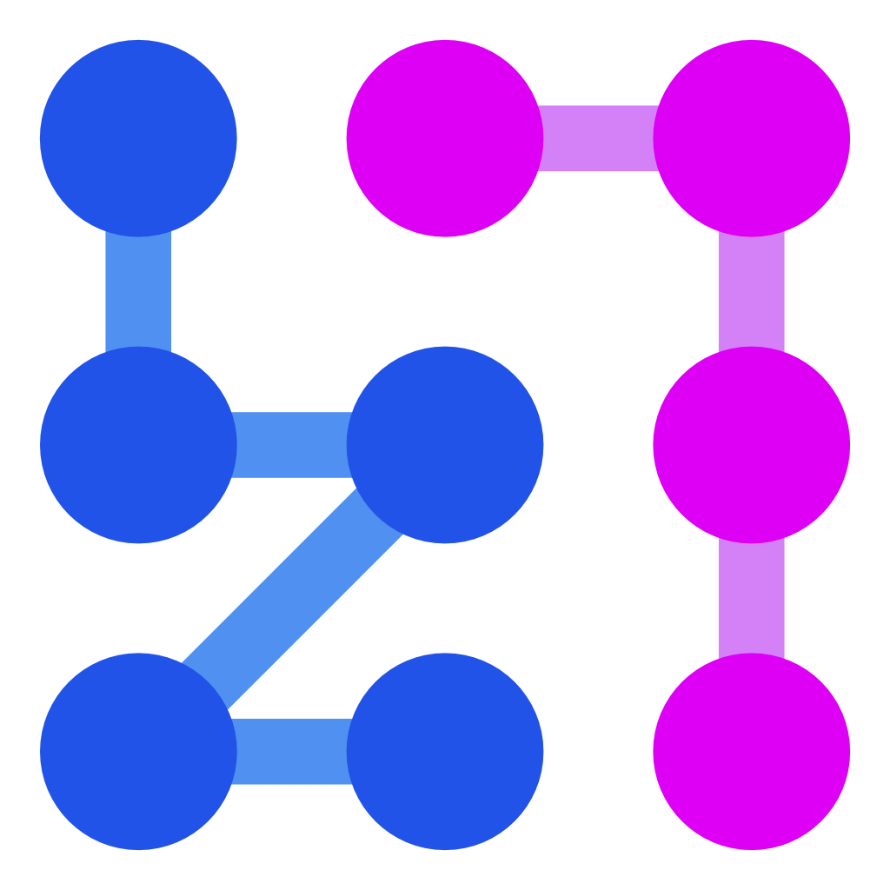

<p align="center">
  <a href="https://stränge.de/" target="blank"></a>
</p>
<h1 align="center"><a href="https://stränge.de/" target="blank">stränge.de</a></h1>
<p align="center">
  A web-based daily German word puzzle game.
</p>

# strangui

This repository contains the frontend Angular code that powers stränge.de.


## Features

* **Daily Puzzles**: Engage with unique puzzles each day (see [`src/app/strands/`](src/app/strands/)).
* **Interactive Calendar**: Navigate and view past games (see [`src/app/calendar/`](src/app/calendar/)).
* **Changelog**: Keep track of updates and new features (see [`src/app/changelog/`](src/app/changelog/)).
* **Game Progress & Results**: Tracks your game progress and results locally (see [`src/app/core/state/core.effects.ts`](src/app/core/state/core.effects.ts)).
* **Tutorial**: Guides new users on how to play (see [`src/app/tutorial/`](src/app/tutorial/)).
* **Progressive Web App (PWA)**: Installable on your device for an app-like experience, with offline capabilities (configured in [`src/app/app.config.ts`](src/app/app.config.ts) and [`./ngsw-config.json`](./ngsw-config.json)).

## Other Components

### Riddle Generation

The riddles are stored as JSON files on a simple web server.

Generation of them is done by a combination of some microservices:

* redis or any other drop-in replacement for it – used as a message queue.
* [straenge-concept-worker](https://github.com/polarfoxDev/straenge-concept-worker) – Generates concepts (super solution, theme and word pool) with OpenAI requests for the actual generator and adds them to the queue. not required, concepts can be provided manually.
* [straenge-riddle-worker](https://github.com/polarfoxDev/straenge-riddle-worker) – Generates riddles based on concepts from the queue. This part is pretty complex and computationally intensive, so it can take a while and can be parallelized by running multiple instances of this worker.
* [straenge-results-worker](https://github.com/polarfoxDev/straenge-results-worker) – Stores results from the queue to JSON files.

## Tech Stack

* **Frontend**: [Angular](https://angular.io/) (v19)
* **State Management**: [NgRx](https://ngrx.io/) (see [`src/app/app.config.ts`](src/app/app.config.ts))
* **Language**: [TypeScript](https://www.typescriptlang.org/)
* **Styling**: CSS (see [src/styles.css](src/styles.css), [src/fonts.css](src/fonts.css))
* **Build Tool**: [Angular CLI](https://angular.dev/tools/cli)
* **Package Manager**: [pnpm](https://pnpm.io/) (see [pnpm-lock.yaml](pnpm-lock.yaml))

## Prerequisites

Before you begin to work on the project, ensure you have met the following requirements:

* You have installed [Node.js](https://nodejs.org/) (which includes npm).
* You have [pnpm](https://pnpm.io/installation) installed globally: `npm install -g pnpm` (or your preferred installation method).
* You have the [Angular CLI](https://angular.dev/tools/cli) installed globally: `pnpm install -g @angular/cli`.

## Getting Started

To get a local copy up and running, follow these simple steps.

### Installation

1. Clone the repository (replace `polarfoxDev` with the actual path if you fork it):

    ```bash
    git clone https://github.com/polarfoxDev/strangui.git
    ```

2. Navigate to the project directory:

    ```bash
    cd strangui
    ```

3. Install dependencies:

    ```bash
    pnpm install
    ```

## Development

This project was generated using [Angular CLI](https://github.com/angular/angular-cli) version 19.0.6.

### Development server

To start a local development server, run:

```bash
ng serve
```

Once the server is running, open your browser and navigate to `http://localhost:4200/`. The application will automatically reload whenever you modify any of the source files.

### Code scaffolding

Angular CLI includes powerful code scaffolding tools. To generate a new component, run:

```bash
ng generate component component-name
```

For a complete list of available schematics (such as `components`, `directives`, or `pipes`), run:

```bash
ng generate --help
```

### Building

To build the project run:

```bash
ng build
```

This will compile your project and store the build artifacts in the `dist/` directory. By default, the production build optimizes your application for performance and speed.

### Running unit tests

To execute unit tests with the [Karma](https://karma-runner.github.io) test runner, use the following command:

```bash
ng test
```

### Running end-to-end tests

For end-to-end (e2e) testing, run:

```bash
ng e2e
```

Angular CLI does not come with an end-to-end testing framework by default. You can choose one that suits your needs.

### Additional Resources

For more information on using the Angular CLI, including detailed command references, visit the [Angular CLI Overview and Command Reference](https://angular.dev/tools/cli) page.

## Contributing

Any contributions you make are greatly appreciated.

If you have a suggestion that would make this better, please fork the repo and create a pull request. You can also simply open an issue.
Don't forget to give the project a star! Thanks!

1. Fork the Project
2. Create your Feature Branch (`git checkout -b feature/AmazingFeature`)
3. Commit your Changes (`git commit -m 'Add some AmazingFeature'`)
4. Push to the Branch (`git push origin feature/AmazingFeature`)
5. Open a Pull Request

## License

Distributed under the **MIT** License. See [`LICENSE`](./LICENSE) for more information.
